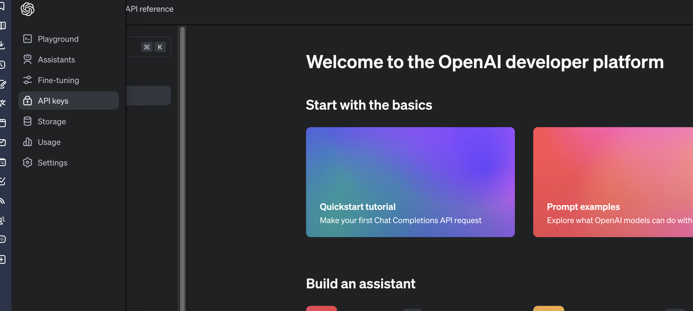
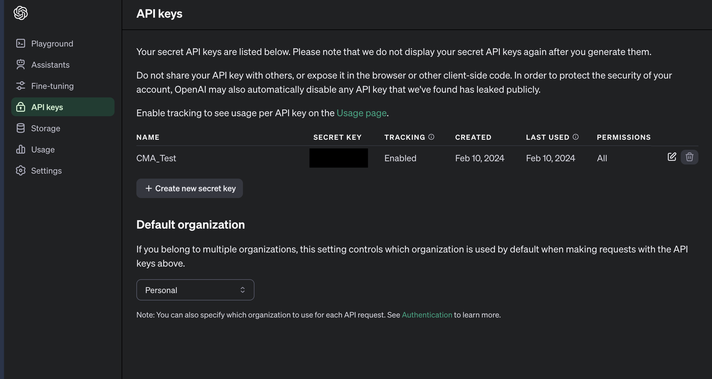

# Keyword Generator

The Keyword Generator is a web application that allows users to generate keywords based on a given URL.

## Features

- Users can input a URL or description
- The application fetches data from the given URL and generates keywords.
- Generated keywords are displayed in a list format.
- The application provides visual feedback to users while generating keywords.
- Link to [presentation slides](https://docs.google.com/presentation/d/13xBS1xERTB-0lRXr5aj6THdqUAKadU6RNprzfgPKL1w/edit?usp=sharing)
- Link to [research paper template](https://docs.google.com/document/d/1X8s9t4N2pl1fZsXUzt8MiZ1ebubeGKnA3gxWTLD-2WU/edit?usp=sharing)

## Technologies Used

- HTML
- CSS (Bootstrap)
- JavaScript (jQuery)
- Python (Flask) for the backend


## Usage

1. Run the Flask application:

    ```
    python app.py
    ```

2. Access the application in your web browser:

    ```
    http://localhost:5000
    ```

3. Enter a URL in the input field and click "Generate Keywords" to see the generated keywords.

# How to get an API Key

openai.com -> login -> API -> API Keys -> Create a new secret key

First Menu


Second Menu


